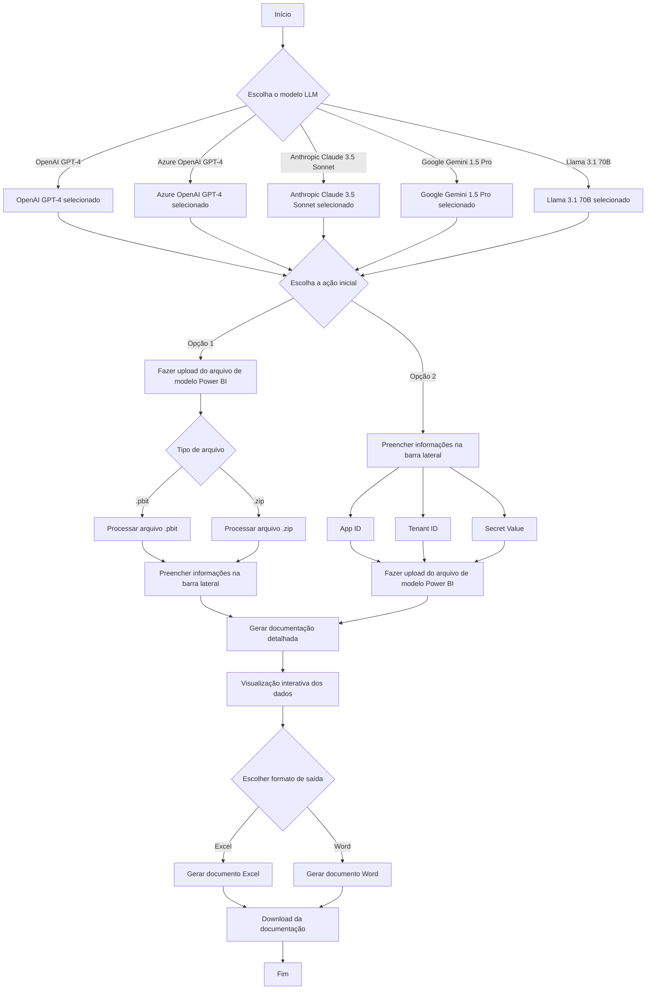

# AutoDoc 2025


AutoDoc é uma ferramenta que simplifica e automatiza a documentação de relatórios do Power BI, ideal para administradores e analistas que buscam eficiência e precisão.

---

## Recursos

- **Upload de Modelos Power BI**: Suporte a arquivos `.pbit` e `.zip`.
- **Documentação Detalhada**: Geração automática em Excel e Word, incluindo tabelas, colunas, medidas e fontes de dados.
- **Visualização Interativa**: Visualize dados antes do download.
- **Automação e Precisão**: Processo rápido, confiável e padronizado.

---

## Acesse o AutoDoc Online

[AutoDoc - Documentador de Power BI](https://autodocpbi.fly.dev/)

---

## Fluxo de Trabalho



---

## Como Usar

1. Preencha App ID, Tenant ID e Secret Value na barra lateral.
2. Faça upload do arquivo `.pbit` ou `.zip`.
3. Visualize os dados e baixe a documentação em Excel ou Word.

---

## Instalação Local

1. **Clone o repositório:**
    ```sh
    git clone https://github.com/LawrenceTeixeira/PBIAutoDoc.git
    cd AutoDoc
    ```

2. **Crie e ative o ambiente virtual:**
    ```sh
    python -m venv .venv
    # Windows
    .venv\Scripts\activate
    # macOS/Linux
    source .venv/bin/activate
    ```

3. **Instale as dependências:**
    ```sh
    pip install -r requirements.txt
    pip install --no-cache-dir chunkipy
    ```

4. **Configure as variáveis de ambiente (`.env`):**
    ```env
    OPENAI_API_KEY=your_openai_api_key
    GROQ_API_KEY=your_groq_api_key
    AZURE_API_KEY=your_azure_api_key
    AZURE_API_BASE=your_endpoint # Exemplo: https://<your alias>.openai.azure.com
    AZURE_API_VERSION=your_version # Exemplo: 2024-02-15-preview
    GEMINI_API_KEY=your_gemini_api_key
    ANTHROPIC_API_KEY=your_anthropic_api_key
    ```
    Consulte outros provedores: [LiteLLM Providers](https://docs.litellm.ai/docs/providers)

5. **Execute o aplicativo:**
    ```sh
    streamlit run app.py --server.fileWatcherType none
    ```

---

## Deploy no Fly.io

```sh
flyctl launch
flyctl deploy
```

### Login/Logout no Fly.io

```sh
flyctl auth login
flyctl auth logout
```

### Instalação manual do Fly.io

```sh
curl -L https://fly.io/install.sh | sh
export PATH=/home/codespace/.fly/bin
```

---

## Pré-requisitos

- Windows, macOS ou Linux
- Python 3.10+
- Internet
- Open AI API Key válida

---

## Sobre

AutoDoc é voltado para administradores e analistas de dados que precisam gerar documentação de alta qualidade para relatórios Power BI, utilizando IA para clareza e detalhamento.

---

## Contribuição

Contribuições são bem-vindas! Abra issues ou pull requests para sugerir melhorias.

---

## Licença

MIT. Veja [LICENSE](LICENSE.md).

---

## Autor

- [Lawrence Teixeira - LinkedIn](https://www.linkedin.com/in/lawrenceteixeira/)
- [Lawrence's Blog](https://lawrence.eti.br)

Contato: [Formulário](https://lawrence.eti.br/contact/)

---

> Simplifique e automatize a documentação dos seus relatórios do Power BI com o **AutoDoc**.
