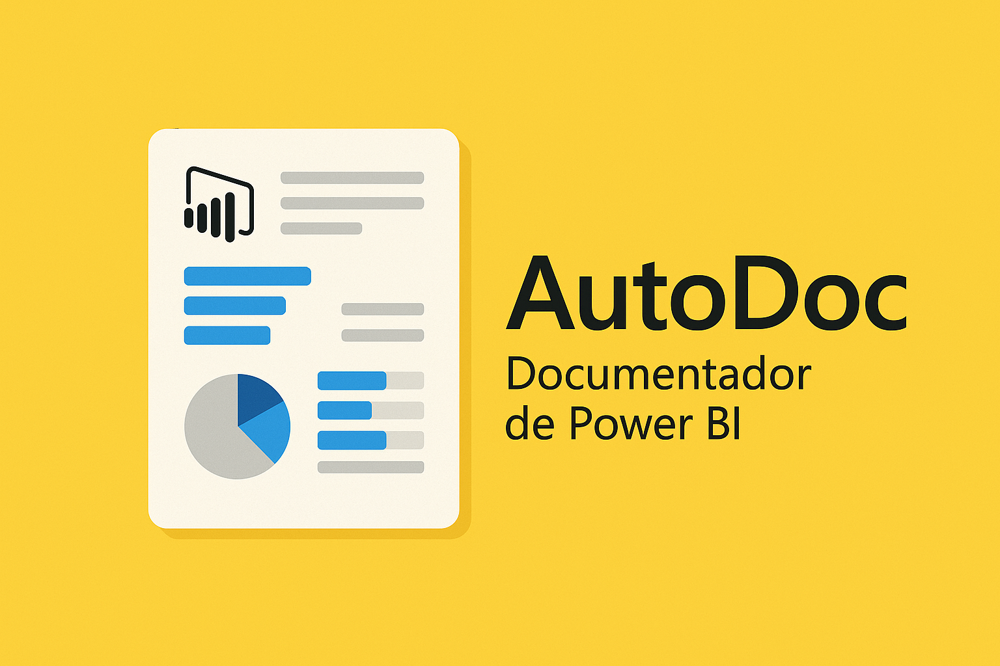

# AutoDoc



AutoDoc é uma ferramenta desenvolvida para simplificar e automatizar o processo de documentação de relatórios do Power BI. Ideal para administradores e analistas que buscam eficiência e precisão na geração de documentações detalhadas e formatadas.

## Funcionalidades

- **Carregar Arquivos de Modelo Power BI**: Faça upload de seus arquivos de modelo (.pbit ou .zip) diretamente no aplicativo.
- **Gerar Documentação Detalhada**: Obtenha documentos completos em formatos Excel e Word, com informações sobre tabelas, colunas, medidas e fontes de dados.
- **Visualização Interativa**: Veja as tabelas e dados detalhados diretamente na interface do aplicativo antes de fazer o download.
- **Eficiência e Precisão**: Automatize o processo de documentação, economizando tempo e garantindo a precisão das informações.

## Execute o AutoDoc
Para executar o Autodoc click neste link: [AutoDoc - Documentador de Power BI](https://autodocpbi.fly.dev/)

## Como Usar o AutoDoc

1. Preencha as informações do App ID, Tenant ID e Secret Value na barra lateral.
2. Faça o upload do arquivo de modelo Power BI (.pbit ou .zip).
3. Visualize os dados e faça o download da documentação gerada em formatos Excel ou Word.

## Instalação

Para instalar e rodar o AutoDoc localmente, siga os passos abaixo:

1. Clone o repositório:

```sh
git clone https://github.com/LawrenceTeixeira/PBIAutoDoc.git
```

2. Navegue até o diretório do projeto:

```sh
cd AutoDoc
```

3. Crie um ambiente virtual e ative-o:

```sh
python -m venv .venv
# No Windows
.venv\Scripts\activate
# No macOS/Linux
source .venv/bin/activate
```

4. Instale as dependências:

```sh
pip install -r requirements.txt
```

5. Crie um arquivo `.env` com as variáveis de ambiente necessárias:

```env
OPENAI_API_KEY=your_openai_api_key
GROQ_API_KEY=your_groq_api_key
AZURE_API_KEY=your_azure_api_key
AZURE_API_BASE=your_endpoint #Example: "https://<your alias>.openai.azure.com"
AZURE_API_VERSION=your_version #Example: 2024-02-15-preview
GEMINI_API_KEY=your_gemini_api_key
ANTHROPIC_API_KEY=your_anthropic_api_key
```
Pata utilização de  outros modelos vá para este link: [LiteLLM Providers](https://docs.litellm.ai/docs/providers)

6. Execute o aplicativo:

```sh
streamlit run app.py
```

## Fazer o deploy do app no Fly.io
```sh
flyctl launch
flyctl deploy
```
## Fazer fazer o login e logout no Fly
```sh
flyctl auth login
flyctl auth logout
```

## Instalar o fly manualmente
```sh
curl -L https://fly.io/install.sh | sh
export PATH=/home/codespace/.fly/bin
```

## Sobre o Aplicativo

AutoDoc é projetado para administradores e analistas de dados que precisam de uma forma eficiente e precisa de gerar documentações de alta qualidade para seus relatórios do Power BI. A ferramenta utiliza tecnologias avançadas de processamento de dados e inteligência artificial para fornecer documentações claras, detalhadas e formatadas de acordo com suas necessidades.

### Como usar o AutoDoc:

1. **Carregar Arquivos**: Faça upload dos seus arquivos de modelo Power BI.
2. **Gerar Documentação**: Obtenha documentos completos em Excel e Word.
3. **Visualização Interativa**: Veja as tabelas e dados detalhados na interface do aplicativo.

## Contribuição

Contribuições são bem-vindas! Sinta-se à vontade para abrir issues e pull requests para melhorar o AutoDoc.

## Licença

Este projeto está licenciado sob a licença MIT. Veja o arquivo [LICENSE](LICENSE.md) para mais detalhes.

## Author
- LinkedIn: [Lawrence Teixeira](https://www.linkedin.com/in/lawrenceteixeira/)
- Blog: [Lawrence's Blog](https://lawrence.eti.br) - Siga meu blog para mais projetos e atualizaçõies.

## Contato

Para mais informações, entre em contato pelo link:[Contato](https://lawrence.eti.br/contact/)

---

Simplifique e automatize a documentação dos seus relatórios do Power BI com o **AutoDoc**.