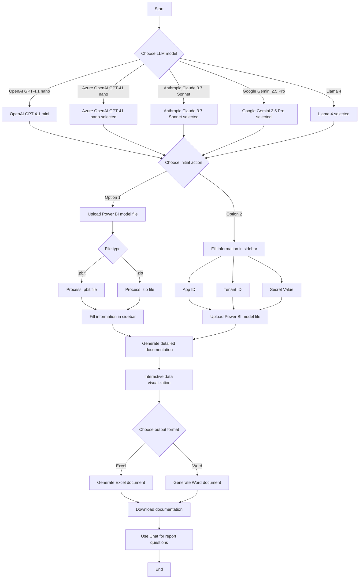

# AutoDoc 2025


AutoDoc is a tool that simplifies and automates the documentation of Power BI reports, ideal for administrators and analysts seeking efficiency and precision.

---

## Features

- **Power BI Model Upload**: Support for `.pbit` and `.zip` files.
- **Detailed Documentation**: Automatic generation in Excel and Word, including tables, columns, measures, and data sources.
- **Interactive Visualization**: View data before downloading.
- **Automation and Precision**: Fast, reliable, and standardized process.

---

## Access AutoDoc Online

[AutoDoc - Power BI Documenter](https://autodocpbi.fly.dev/)

---

## Chat Functionality

- **Intelligent Chat about the Report**: After generating or loading documentation, use the integrated chat to ask questions about tables, DAX measures, columns, and relationships in your Power BI model. The assistant responds based on the loaded report information, providing detailed and technical explanations.

---

## Workflow



---

## How to Use

1. Fill in App ID, Tenant ID, and Secret Value in the sidebar.
2. Upload the `.pbit` or `.zip` file.
3. View the data and download the documentation in Excel or Word.
4. **Access Chat**: After processing the report, click the "💬 Chat" button to open the chat. Ask questions about tables, measures, columns, or relationships in your Power BI model. The assistant will respond based on the loaded data.

---

## Local Installation

1. **Clone the repository:**
    ```sh
    git clone https://github.com/LawrenceTeixeira/PBIAutoDoc.git
    cd AutoDoc
    ```

2. **Create and activate virtual environment:**
    ```sh
    python -m venv .venv
    # Windows
    .venv\Scripts\activate
    # macOS/Linux
    source .venv/bin/activate
    ```

3. **Install dependencies:**
    ```sh
    pip install -r requirements.txt
    pip install --no-cache-dir chunkipy
    ```

4. **Configure environment variables (`.env`):**
    ```env
    OPENAI_API_KEY=your_openai_api_key
    GROQ_API_KEY=your_groq_api_key
    AZURE_API_KEY=your_azure_api_key
    AZURE_API_BASE=your_endpoint # Example: https://<your alias>.openai.azure.com
    AZURE_API_VERSION=your_version # Example: 2024-02-15-preview
    GEMINI_API_KEY=your_gemini_api_key
    ANTHROPIC_API_KEY=your_anthropic_api_key
    ```
    Check other providers: [LiteLLM Providers](https://docs.litellm.ai/docs/providers)

5. **Run the application:**
    ```sh
    streamlit run app.py --server.fileWatcherType none
    python -X utf8 -m streamlit run app.py --server.fileWatcherType none
    ```

---

## Deploy on Fly.io

```sh
flyctl launch
flyctl deploy
```

### Login/Logout on Fly.io

```sh
flyctl auth login
flyctl auth logout
```

### Manual Fly.io Installation

```sh
curl -L https://fly.io/install.sh | sh
export PATH=/home/codespace/.fly/bin
```

---

## Prerequisites

- Windows, macOS, or Linux
- Python 3.10+
- Internet connection
- Valid OpenAI API Key

---

## About

AutoDoc is designed for data administrators and analysts who need to generate high-quality documentation for Power BI reports, using AI for clarity and detail.

---

## Contributing

Contributions are welcome! Open issues or pull requests to suggest improvements.

---

## License

MIT. See [LICENSE](LICENSE.md).

---

## Author

- [Lawrence Teixeira - LinkedIn](https://www.linkedin.com/in/lawrenceteixeira/)
- [Lawrence's Blog](https://lawrence.eti.br)

Contact: [Form](https://lawrence.eti.br/contact/)

---

> Simplify and automate the documentation of your Power BI reports with **AutoDoc**.
