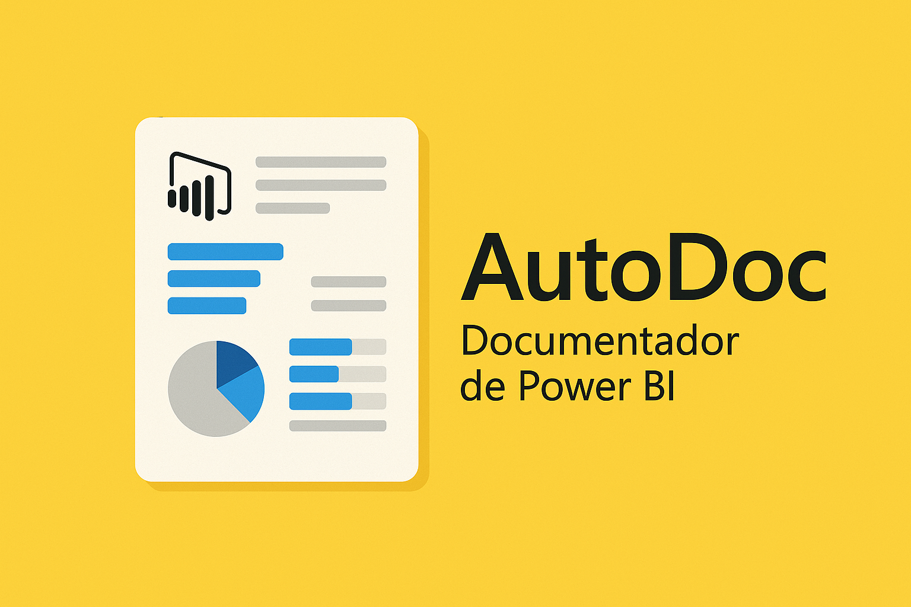
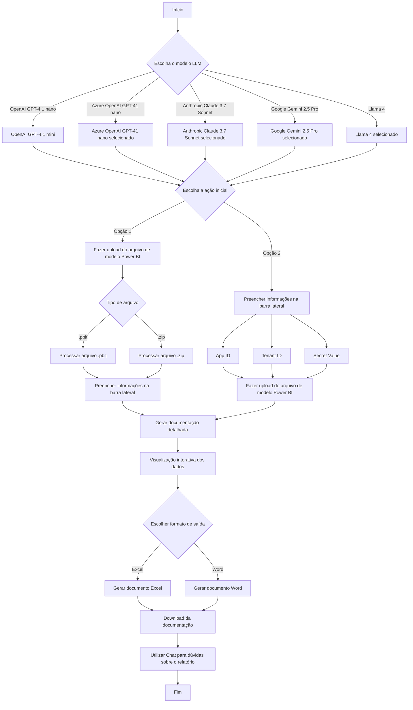

# AutoDoc 2025



AutoDoc é uma ferramenta que simplifica e automatiza a documentação de relatórios do Power BI, ideal para administradores e analistas que buscam eficiência e precisão.

---

## Recursos

- **Upload de Modelos Power BI**: Suporte a arquivos `.pbit` e `.zip`.
- **Documentação Detalhada**: Geração automática em Excel e Word, incluindo tabelas, colunas, medidas e fontes de dados.
- **Visualização Interativa**: Visualize dados antes do download.
- **Automação e Precisão**: Processo rápido, confiável e padronizado.

---

## Acesse o AutoDoc Online

[AutoDoc - Documentador de Power BI](https://autodoc.lawrence.eti.br/)

---

## Funcionalidade de Chat

- **Chat Inteligente sobre o Relatório**: Após gerar ou carregar a documentação, utilize o chat integrado para tirar dúvidas sobre tabelas, medidas DAX, colunas e relacionamentos do seu modelo Power BI. O assistente responde com base nas informações do relatório carregado, fornecendo explicações detalhadas e técnicas.

---

## Fluxo de Trabalho



---

## Como Usar

1. Preencha App ID, Tenant ID e Secret Value na barra lateral.
2. Faça upload do arquivo `.pbit` ou `.zip`.
3. Visualize os dados e baixe a documentação em Excel ou Word.
4. **Acesse o Chat**: Após processar o relatório, clique no botão "💬 Chat" para abrir o chat. Faça perguntas sobre tabelas, medidas, colunas ou relacionamentos do seu modelo Power BI. O assistente responderá com base nos dados carregados.

---

## Instalação Local

1. **Clone o repositório:**
    ```sh
    git clone https://github.com/LawrenceTeixeira/PBIAutoDoc.git
    cd AutoDoc
    ```

2. **Crie e ative o ambiente virtual:**
    ```sh
    python -m venv .venv
    # Windows
    .venv\Scripts\activate
    # macOS/Linux
    source .venv/bin/activate
    ```

3. **Instale as dependências:**
    ```sh
    pip install -r requirements.txt
    pip install --no-cache-dir chunkipy
    ```

4. **Configure as variáveis de ambiente (`.env`):**
    ```env
    OPENAI_API_KEY=your_openai_api_key
    GROQ_API_KEY=your_groq_api_key
    AZURE_API_KEY=your_azure_api_key
    AZURE_API_BASE=your_endpoint # Exemplo: https://<your alias>.openai.azure.com
    AZURE_API_VERSION=your_version # Exemplo: 2024-02-15-preview
    GEMINI_API_KEY=your_gemini_api_key
    ANTHROPIC_API_KEY=your_anthropic_api_key

    # Modelos disponíveis para seleção (separados por vírgula)
    AVAILABLE_MODELS=groq/meta-llama/llama-4-scout-17b-16e-instruct,groq/openai/gpt-oss-120b,gpt-5-mini,gpt-5,azure/gpt-4.1-mini,gemini/gemini-2.5-flash-preview-04-17,claude-3-7-sonnet-20250219,deepseek/deepseek-chat

    # Modelo padrão (opcional)
    DEFAULT_MODEL=groq/meta-llama/llama-4-scout-17b-16e-instruct   

    # Para você rodar modelos localmente com Ollama: https://ollama.com/search
    #OLLAMA_BASE_URL = "http://localhost:11434" 
    ```
    Consulte outros provedores: [LiteLLM Providers](https://docs.litellm.ai/docs/providers)

5. **Execute o aplicativo:**
    ```sh
    streamlit run app.py --server.fileWatcherType none
    python -X utf8 -m streamlit run app.py --server.fileWatcherType none
    ```

---

## Deploy no Fly.io

```sh
flyctl launch
flyctl deploy
```

### Login/Logout no Fly.io

```sh
flyctl auth login
flyctl auth logout
```

### Instalação manual do Fly.io

```sh
curl -L https://fly.io/install.sh | sh
export PATH=/home/codespace/.fly/bin
```

---

## Pré-requisitos

- Windows, macOS ou Linux
- Python 3.10+
- Internet
- Open AI API Key válida

---

## Sobre

AutoDoc é voltado para administradores e analistas de dados que precisam gerar documentação de alta qualidade para relatórios Power BI, utilizando IA para clareza e detalhamento.

---

## Contribuição

Contribuições são bem-vindas! Abra issues ou pull requests para sugerir melhorias.

---

## Licença

MIT. Veja [LICENSE](LICENSE.md).

---

## Autor

- [Lawrence Teixeira - LinkedIn](https://www.linkedin.com/in/lawrenceteixeira/)
- [Lawrence's Blog](https://lawrence.eti.br)

Contato: [Formulário](https://lawrence.eti.br/contact/)

---

> Simplifique e automatize a documentação dos seus relatórios do Power BI com o **AutoDoc**.
