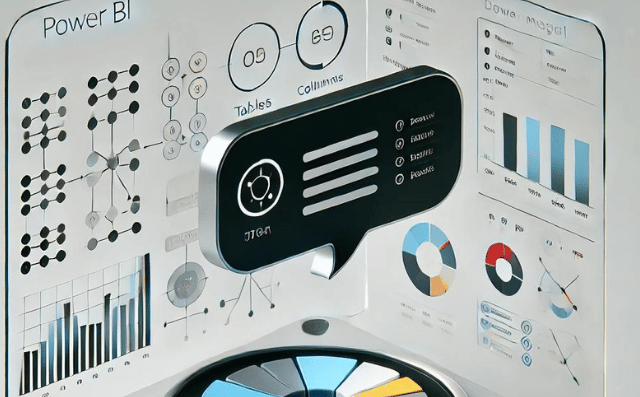

# Chat



O **Chat** é uma ferramenta complementar ao AutoDoc, projetada para oferecer uma experiência interativa ao permitir que você se comunique diretamente com modelos de inteligência artificial. Ele possibilita diálogos em tempo real com modelos generativos, trazendo uma nova camada de flexibilidade e eficiência ao processo de documentação e análise. Os arquivos do Chat estão localizados dentro da pasta `chat` no projeto AutoDoc, permitindo fácil integração com as funcionalidades já conhecidas do AutoDoc.

## Funcionalidades

- **Converse com o Modelo**: Interaja diretamente com seu modelo de IA para gerar insights, esclarecer dúvidas sobre dados e receber feedback em tempo real.
- **Integração com AutoDoc**: Utilize o Chat em conjunto com o AutoDoc para refinar a geração de documentação e obter respostas contextuais sobre os dados do Power BI.
- **Flexibilidade de Modelos**: Escolha entre diversos modelos de linguagem (OpenAI GPT-4, Azure OpenAI, Llama, entre outros) para adaptar o Chat às suas necessidades específicas.
- **Eficiência e Personalização**: Automatize respostas e fluxos de trabalho com base nas interações, economizando tempo e garantindo precisão nas análises.

## Execute o Chat

Para executar o Chat e começar a interagir com o seu modelo, siga as instruções de instalação e uso abaixo.

## Como Usar o Chat

1. Escolha o modelo de IA com o qual deseja interagir (OpenAI GPT-4, Azure OpenAI, Llama, entre outros).
2. Faça o upload dos dados ou inicie uma conversa diretamente com o modelo.
3. Visualize e refine as respostas em tempo real.

## Instalação

Para instalar e rodar o Chat localmente, siga os passos abaixo:

1. Clone o repositório:

```sh
git clone https://github.com/LawrenceTeixeira/PBIAutoDoc.git
```

2. Navegue até o diretório do Chat:

```sh
cd AutoDoc/chat
```

3. Crie um ambiente virtual e ative-o:

```sh
python -m venv .venv
# No Windows
.venv\Scripts\activate
# No macOS/Linux
source .venv/bin/activate
```

4. Instale as dependências:

```sh
pip install -r ../requirements.txt
```

5. Crie um arquivo `.env` com as variáveis de ambiente necessárias:

```env
OPENAI_API_KEY=your_openai_api_key
GROQ_API_KEY=your_groq_api_key
AZURE_API_KEY=your_azure_api_key
AZURE_API_BASE=your_endpoint
AZURE_API_VERSION=your_version
GEMINI_API_KEY=your_gemini_api_key
ANTHROPIC_API_KEY=your_anthropic_api_key
```

6. Execute o aplicativo:

```sh
streamlit run chat/chat.py
```

## Fazer o deploy do Chat no Fly.io

```sh
flyctl launch
flyctl deploy --config chat/fly.toml
```

## Pré-requisitos

- Computador com Windows e acesso à internet
- Python 3.9 ou superior
- Conta com créditos nas APIs (OpenAI, Azure, etc.)

## Sobre o Chat

O **Chat** é projetado para administradores e analistas que desejam uma interação dinâmica e direta com modelos de IA, permitindo consultas, geração de insights e respostas automatizadas. Ele pode ser utilizado em conjunto com o AutoDoc ou de forma independente, para maximizar o valor dos dados e otimizar a tomada de decisões.

### Como usar o Chat:

1. **Escolha o Modelo**: Selecione o modelo de IA com o qual deseja interagir.
2. **Inicie a Conversa**: Faça upload de dados ou inicie uma interação textual.
3. **Obtenha Resultados**: Receba respostas precisas e insights em tempo real.

## Contribuição

Contribuições são bem-vindas! Sinta-se à vontade para abrir issues e pull requests para melhorar o Chat.

## Author

- LinkedIn: [Lawrence Teixeira](https://www.linkedin.com/in/lawrenceteixeira/)
- Blog: [Lawrence's Blog](https://lawrence.eti.br) - Siga meu blog para mais projetos e atualizações.

## Contato

Para mais informações, entre em contato pelo link: [Contato](https://lawrence.eti.br/contact/)